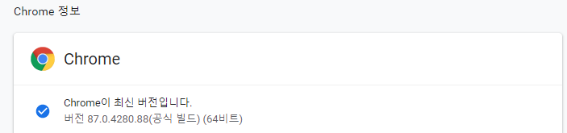

# SeleniumNaverCafeWrite
네이버카페에서 자동 글쓰기(Not Headless)
___
## _Warning!_
> 재미로 즐기는 것이므로, 악질적인 홍보와 같은 광고 산업에 악용하면 안됨.  
> 개인 책임임.  
> 코드는 얘를 싸지른거마냥 복잡하게 구성되었음.

## _Modules_
> ### _Terminal_
> ```pip3 install pyperclip ```   
> ```pip3 install selenium ```   

## _How to use it?_
> run.py를 직접 수정하면 된다.   
> 각 소스 코드마다 주석처리 되어 있으니, 참고 바람   
> 각 버전 main.py 참고   
> #### 1.0.1
> > ```naver = Naver()``` Not Headless node   
> > ```naver = Naver(True)``` Headless mode   
> > ```naver.n_id = "INPUT_YOUR_ID_STR"``` 네이버 아이디   
> > ```naver.n_pw = "INPUT_YOUR_PW_STR"``` 네이버 비밀번호   
> > ```naver.cafeID = INPUT_CAFE_ID_INT``` 가입된 카페 번호   
> > ```naver.menuID = INPUT_MENU_ID_INT``` 가입된 카페의 메뉴 번호   
> > ```naver.title = "INPUT_TITLE_STR"``` 글쓰기 제목   
> > ```naver.content = "INPUT_CONTENT_HTML_STR"``` 글쓰기 본문(내용)   
> > ```naver.imgUrl = "INPUT_YOUR_IMAGE_STR"``` 대표 이미지 설정 (절대 경로만 가능. Ex) "C:\\Users\\Project_selenium\\sample.png")   
> > ```naver.sleep_sec = INPUT_SLEEP_INT``` 지연 시간(똥컴은 3초, 보통컴은 0.5 ~ 1초, 쩌는 컴은 0.1 ~ 0.5초 추천), Default값은 0.5초로 되어 있음.   
> > ```naver.main()``` 앱 실행 함수
> #### 1.0.2    
> > ```naver.BTime = "INPUT_YOU_WANT_TIME"``` 예약 시간 Ex) "" 예약X, "23:53:52" 예약됨. 반드시 ':' 넣어서 시간 구분해야 함   
> #### _Chorme Current Version(2020/12/26)_
> > Driver.exe 파일은 현재 파일에 module 폴더에 넣어야 함.   
> > Ex) ../selenium/module/ 에 넣기.   
> > driver.exe 파일 명을 바꾸면 안돼요.   (Don't renaming the driver.exe)
> > 버전에 맞는 각 브라우저 드라이버를 설치 필요.(ex: Chrome)
> >    
> > ```Current Version: 87.0.4280.88```   
> #### _How to Content(HTML) Create_
> > content를 HTML양식으로 꾸미고 싶다면?   
> > 카페 글쓰기 본문 내용을 제대로 꾸미고 싶다면?   
> > [SmartEditor 2.0 Demo]에 들어가서 본문 내용을 마음대로 적고   
> > 복사하고 content 변수의 ""(큰따옴표)안에 붙여넣으면 된다.   
> > 오른쪽 밑을 보면 [Editor] | HTML | TEXT가 보일 것이다.   
> > Editor에서 마음대로 작성한 후에, HTML 모드로 바꾸면 내용들이 HTML 양식대로 변환한다.   

## _Comment_
> 네이버 API...? 솔직히 네이버 카페 글쓰기 API를 이용할 생각이 있었는데,   
> 설명이 병신같이 써놨고 초급 개발자가 네트워크 기술서에 접근하기가 쉽겠냐?   
> 나도 처음에 신청해서 써봤다. 리다이렉트 호스팅을 빌려보고 Access Token에 대해서 조사해보고,   
> 왜 자꾸 401 에러가 뜨는지 API 가이드 문서에 하나도 안 나와 있고, 계속 삽질을 해보니까    
> 네아로 API 문서에 있는 것이였다. ㅈ같이 설명해놓으니까   
> 네이버 API를 처음 써보는 고급 개발자이라도 찰떡같이 이해하기가 어렵고 계속 조사를 해야 이해할 듯 ㅋㅋㅋㅋ

## _Links_
> [SmartEditor 2.0](https://github.com/naver/smarteditor2)   
> [SmartEditor 2.0 Demo](http://naver.github.io/smarteditor2/demo/)

## _update_
> #### 1.0.0(2020/12/25)
> > 애새끼마냥 싸지러놓음 코드가 복잡함.
> #### 1.0.1(2020/12/27)
> > 클래스로 싹다 정리한 후, 가이드 라인을 추가함.
> #### 1.0.2(2020/12/27)
> > Timer기능 추가
## _Donate_
> Headless 기능을 쓸 수 있습니다.   
> Headless 기능: 백그라운드에서 실행하기 때문에, 실행 도중에 다른 작업을 수행할 수 있습니다. 속도가 빠릅니다. (그래픽 처리 같은게 필요없어져서 그런 듯)    
